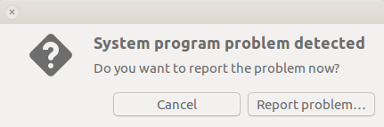

# Ubuntu Desktop Ansible Config

A set of Ansible roles for configuring Ubuntu 16.04+ desktop environment. It automates the installation and configuration of essential, good to have utility programs (customizable if needed), plus other developer tools.

### Install requirements

>Git and Ansible are the only requirements

```shell
$ sudo apt install git
$ git clone https://github.com/pam79/ubuntu-desktop-ansible-config.git Configurator
$ cd Configurator && bash ansible-setup.sh
```

### Run the playbook in cwd

Before you proceed, it is highly recommended that you go through the "Available roles" section below to find out which roles require some customization.

##### Option 1: Run the playbook without any encrypted files
>Enter your sudo password when prompted

```shell
$ ansible-playbook desktop.yml --skip-tags "vaulted" --ask-become-pass
```

##### Option 2: Run the playbook but with your own encrypted files
>Files to change: bookmarks.html.vault, JavaAgent.jar

```shell
$ ansible-playbook desktop.yml --ask-become-pass --ask-vault-pass
```

##### Option 3: Run the playbook but with unencrypted files of your own
>Files to replace: bookmarks.html.vault, JavaAgent.jar

```shell
$ ansible-playbook desktop.yml --ask-become-pass
```

When configuration of your system is complete, restart your computer for all the changes to take effect.

When you run into connection timeout issues at some point in the configuration process, latent internet connection may be the problem. To solve this, simply rerun the above playbook and hopefully, things should be ok.

### Available roles

>You can disable a role by commenting it out in desktop.yml playbook. All paths are relative to the `roles` directory, unless otherwise stated.

<table width="100%">
    <tr>
        <th width="25%">Role</th>
        <th width="40%">Description</th>
        <th width="35%">Customization Options</th>
    </tr>
    <!--------------------------------------------------------->
    <tr><td width="100%" colspan=3><b>Common Tools</b></td></tr>
    <!--------------------------------------------------------->
    <tr>
        <td width="25%"><i>locales</i></td>
        <td width="40%">
         A set of parameters that defines the user's language, region and any special variant preferences. The role takes an existing locale file located at: <a href="./roles/locales/files"><i>locales/files</i></a> - customized or not (e.g. <i>ak_GH</i>, <i>en_GH</i>, <i>en_US</i>, <i>de_NL</i>) and sets it as the default locale for your system.
        </td>
        <td width="35%">
         en_GH and Africa/Accra are the default locales provided. Replace them with your own if your language and timezone are different. The default configuration is located at: <a href="./roles/locales/defaults/main.yml"><i>locales/defaults/main.yml</i></a>
        </td>
    </tr>
    <tr>
        <td width="25%"><i>essentials</i></td>
        <td width="40%">
         Provides the most basic libraries that are globally required by most packages.
        </td>
        <td width="35%">
         Packages can be added or removed from the list. Also with GNOME 3 PPA added nautilus is automatically upgraded.
        </td>
    </tr>
    <tr>
        <td width="25%"><i>git</i></td>
        <td width="40%">
         Git is a version control system for tracking changes in computer files and coordinating work on those files among multiple people.
        </td>
        <td width="35%">
         You should modify the default git global config values found at: <a href="./roles/git/defaults/main.yml"><i>git/defaults/main.yml</i></a>
        </td>
    </tr>
    <tr>
        <td width="25%"><i>oh-my-zsh</i></td>
        <td width="40%">
          An open source, community-driven framework for managing your zsh configuration.
        </td>
        <td width="35%">
          The default configs are sensible enough. Little or no customization is required.
        </td>
    </tr>
    <tr>
        <td width="25%"><i>java-openjdk</i></td>
        <td width="40%">
          A free and open source implementation of the Java Platform, Standard Edition (Java SE).
        </td>
        <td width="35%">
          You can add more SDKs if required by your project.
        </td>
    </tr>
    <!------------------------------------------------------------>
    <tr><td width="100%" colspan=3><b>Developer Tools</b></td></tr>
    <!------------------------------------------------------------>
    <tr>
        <td width="25%"><i>apache-maven</i></td>
        <td width="40%">
          A software project management and comprehension tool.
        </td>
        <td width="35%">
          n/a
        </td>
    </tr>
    <tr>
        <td width="25%"><i>atom</i></td>
        <td width="40%">
          A free and open-source text and source code editor.
        </td>
        <td width="35%">
          n/a
        </td>
    </tr>
    <tr>
        <td width="25%"><i>dia</i></td>
        <td width="40%">
          A free and open source general-purpose diagramming software.
        </td>
        <td width="35%">
          n/a
        </td>
    </tr>
    <tr>
        <td width="25%"><i>docker</i></td>
        <td width="40%">
          A computer program that performs operating-system-level virtualization also known as containerization.
        </td>
        <td width="35%">
          n/a
        </td>
    </tr>
    <tr>
        <td width="25%"><i>docker-images</i></td>
        <td width="40%">
          Pulls docker images onto your desktop for later use. The role also creates, ready to use aliases for the downloaded images.
        </td>
        <td width="35%">
          The default shell config file for the aliases is <i>.zshrc</i>. Change this to .bashrc if you disabled <i>oh-my-zsh</i> role.
        </td>
    </tr>
    <tr>
        <td width="25%"><i>google-chrome</i></td>
        <td width="40%">
          A freeware web browser developed by Google.
        </td>
        <td width="35%">
          The bookmarks file provided is encrypted using <b>ansible-vault</b>. To import your bookmarks, include a <i>bookmarks.html.vault</i> file at the following location: <a href="./roles/google-chrome/files"><i>google-chrome/files</i></a>. or simply delete the file if you are not importing bookmarks.
          <br /><br />Also, you can customize which extensions get installed by modifying <a href="./roles/google-chrome/tasks/main.yml"><i>google-chrome/tasks/main.yml</i></a> file.
        </td>
    </tr>
    <tr>
        <td width="25%"><i>jetbrains-idea</i></td>
        <td width="40%">
          Jetbrains Intellij IDEA is an IDE for polyglot software development. It is developed by JetBrains, and is available as a community edition, as well as a proprietary / commercial edition.
        </td>
        <td width="35%">
          The default edition is <i>ultimate</i>. you can change to <i>community</i> if you don't have a commercial license or javaagent.
          <br /><br />The JavaAgent file provided is encrypted using <b>ansible-vault</b>. Please provide your own if you intend using this option.
          <br /><br />Also, if you are upgrading from an older version to this version, make sure you have exported all of your settings first before running the playbook.
        </td>
    </tr>
    <tr>
        <td width="25%"><i>jetbrains-idea-plugins</i></td>
        <td width="40%">
          Intellij IDEA IDE Plugins. The plugin repository is provided at: <a href="http://plugins.jetbrains.com/idea"><i>plugins.jetbrains.com/idea</i></a>
        </td>
        <td width="35%">
          You can add or remove plugins from the following location: <a href="./roles/jetbrains-idea-plugins/defaults/main.yml"><i>jetbrains-idea-plugins/defaults/main.yml</i></a>. You need the <i>id</i> of a plugin if you want to add it to the list. To do this search for the plugin's github repo and look for the &lt;id&gt; tag inside the <i>META&#x2011;INF/plugin.xml</i> file.
        </td>
    </tr>
    <tr>
        <td width="25%"><i>smartgit</i></td>
        <td width="40%">
          A Git client for Windows, Mac and Linux. It is free for non-commercial use, provides a graphical access to Git repositories and can access Subversion repositories.
        </td>
        <td width="35%">
          n/a
        </td>
    </tr>
    <tr>
        <td width="25%"><i>sublime</i></td>
        <td width="40%">
          A proprietary cross-platform source code editor  with a Python API.
        </td>
        <td width="35%">
          n/a
        </td>
    </tr>
    <tr>
        <td width="25%"><i>virtualbox</i></td>
        <td width="40%">
          A free and open-source hypervisor for x86 computers currently being developed by Oracle Corporation.
        </td>
        <td width="35%">
          n/a
        </td>
    </tr>
    <tr>
        <td width="25%"><i>vagrant</i></td>
        <td width="40%">
          An open-source software  product for building and maintaining portable virtual software development environments.
        </td>
        <td width="35%">
          n/a
        </td>
    </tr>
    <tr>
        <td width="25%"><i>mini-kube</i></td>
        <td width="40%">
          A tool that makes it easy to run Kubernetes locally.
        </td>
        <td width="35%">
          n/a
        </td>
    </tr>
    <!---------------------------------------------------------->
    <tr><td width="100%" colspan=3><b>Utility Tools</b></td></tr>
    <!---------------------------------------------------------->
    <tr>
        <td width="25%"><i>brave</i></td>
        <td width="40%">
          Brave is a free and open-source web browser based on the Chromium web browser and its Blink engine, announced by the co-founder of the Mozilla project and creator of JavaScript, Brendan Eich.
        </td>
        <td width="35%">
          n/a
        </td>
    </tr>
    <tr>
        <td width="25%"><i>calibre</i></td>
        <td width="40%">
          A powerful and easy to use e-book manager.
        </td>
        <td width="35%">
          n/a
        </td>
    </tr>
    <tr>
        <td width="25%"><i>gnome-chess</i></td>
        <td width="40%">
          A 2D chess game, where games can be played between a combination of human and computer players.
        </td>
        <td width="35%">
          n/a
        </td>
    </tr>
    <tr>
        <td width="25%"><i>gnome-tweak-tool</i></td>
        <td width="40%">
          A configuration tool to enable customization of advanced options for GNOME 3.
        </td>
        <td width="35%">
          This role works best with <i>gnome3&#x2011;desktop</i> role.
        </td>
    </tr>
    <tr>
        <td width="25%"><i>gnome-user-share</i></td>
        <td width="40%">
          A session service that enables easy sharing of files between several computers.
        </td>
        <td width="35%">
          n/a
        </td>
    </tr>
    <tr>
        <td width="25%"><i>gnucash</i></td>
        <td width="40%">
          A personal and small-business financial-accounting software.
        </td>
        <td width="35%">
          n/a
        </td>
    </tr>
    <tr>
        <td width="25%"><i>rambox</i></td>
        <td width="40%">
          Free, Open Source and Cross Platform messaging and emailing app that combines common web applications into one.
        </td>
        <td width="35%">
          n/a
        </td>
    </tr>
    <tr>
        <td width="25%"><i>wavebox</i></td>
        <td width="40%">
          Similar to Rambox, Wavebox lets you bring all your web communication tools together for faster, smarter working.
        </td>
        <td width="35%">
          n/a
        </td>
    </tr>
    <tr>
        <td width="25%"><i>xdman</i></td>
        <td width="40%">
          A powerful tool to increase download speed up-to 500%.
        </td>
        <td width="35%">
          For some reason, I had to run xdman at least once before google chrome could detect it.
        </td>
    </tr>
    <tr>
        <td width="25%"><i>inkscape</i></td>
        <td width="40%">
          A free and open-source vector graphics editor; it can be used to create or edit vector graphics such as illustrations, diagrams, line arts, charts, logos and complex paintings.
        </td>
        <td width="35%">
          n/a
        </td>
    </tr>
    <tr>
        <td width="25%"><i>kdenlive</i></td>
        <td width="40%">
          A free and open-source video editing software based on the MLT Framework, KDE and Qt.
        </td>
        <td width="35%">
          n/a
        </td>
    </tr>
    <tr>
        <td width="25%"><i>keepass-xc</i></td>
        <td width="40%">
          A cross-platform password manager that allows you to store all of your passwords in one location.
        </td>
        <td width="35%">
          n/a
        </td>
    </tr>
    <tr>
        <td width="25%"><i>rosegarden</i></td>
        <td width="40%">
          A free software digital audio workstation program developed for Linux with ALSA and Qt4.
        </td>
        <td width="35%">
          n/a
        </td>
    </tr>
    <tr>
        <td width="25%"><i>simple-screen-recorder</i></td>
        <td width="40%">
          A Qt-based screencast software made for Linux operating systems, which was created as a simpler alternative to programs such as ffmpeg/avconv and VLC.
        </td>
        <td width="35%">
          n/a
        </td>
    </tr>
    <tr>
        <td width="25%"><i>sound-converter</i></td>
        <td width="40%">
          A free and open-source transcoder for digital audio files. It uses GStreamer for input and output files. It has multi threaded design and can also extract the audio from videos.
        </td>
        <td width="35%">
          n/a
        </td>
    </tr>
    <tr>
        <td width="25%"><i>sound-juicer</i></td>
        <td width="40%">
          A GTK+-based graphical front-end to the cdparanoia CD ripping library.
        </td>
        <td width="35%">
          n/a
        </td>
    </tr>
    <tr>
        <td width="25%"><i>unity-tweak-tool</i></td>
        <td width="40%">
          A configuration tool for the Unity Desktop.
        </td>
        <td width="35%">
          n/a
        </td>
    </tr>
    <tr>
        <td width="25%"><i>woe-usb</i></td>
        <td width="40%">
          A tool with both GUI and CLI interfaces for creating bootable Windows installer USB stick from an ISO or DVD.
        </td>
        <td width="35%">
          n/a
        </td>
    </tr>
    <!------------------------------------------------------------>
    <tr><td width="100%" colspan=3><b>Other Tools</b></td></tr>
    <!------------------------------------------------------------>
    <tr>
        <td width="25%"><i>customize-ui</i></td>
        <td width="40%">
          Currently customizes datetime, appearance, and specifies the <i>shutdown</i> action when power is critically low.
        </td>
        <td width="35%">
          * Date and Time: <br />
          You can customize the extra timezone information added for different locations from here: <a href="./roles/customize-ui/defaults/main.yml"><i>customize-ui/defaults/main.yml</i></a><br /><br />
          * Appearance: default (disabled) <br />
          Add your preferred wallpapers here: <a href="./roles/customize-ui/files"><i>customize-ui/files</i></a>. Make sure to change the following variables if necessary: <i>wallpaper_mode, wallpaper_name, wallpaper_directory and wallpaper_file_path</i><br /><br />
          There are other tasks that are also disabled by default. You can enable them by uncommenting them out in: <a href="./roles/customize-ui/tasks/main.yml"><i>customize-ui/tasks/main.yml</i></a>
        </td>
    </tr>
    <tr>
        <td width="25%"><i>disable-apport</i></td>
        <td width="40%">
          Turn off Apport - the crash report service. It also prevents the ff popup:
            
        </td>
        <td width="35%">
          You can temporarily override this with: <i>`sudo service apport start force_start=1`</i>
        </td>
    </tr>
    <tr>
        <td width="25%"><i>clean-apt-entries</i></td>
        <td width="40%">
          Detects and deactivates duplicate Apt source entries in <i>/etc/sources.list</i> and <i>/etc/sources.list.d/*.list</i>.
        </td>
        <td width="35%">
          n/a
        </td>
    </tr>
    <tr>
        <td width="25%"><i>setup-gnome3-desktop</i></td>
        <td width="40%">
          A desktop environment which uses GNOME Shell engine and is composed of free and open-source software that runs on Linux and most BSD derivatives.
        </td>
        <td width="35%">
          This role is disabled by default. To enable it simply uncomment the role in <a href="./desktop.yml"><i>desktop.yml</i></a> playbook, under the <b>Other Tools</b> section.
        </td>
    </tr>
</table>
